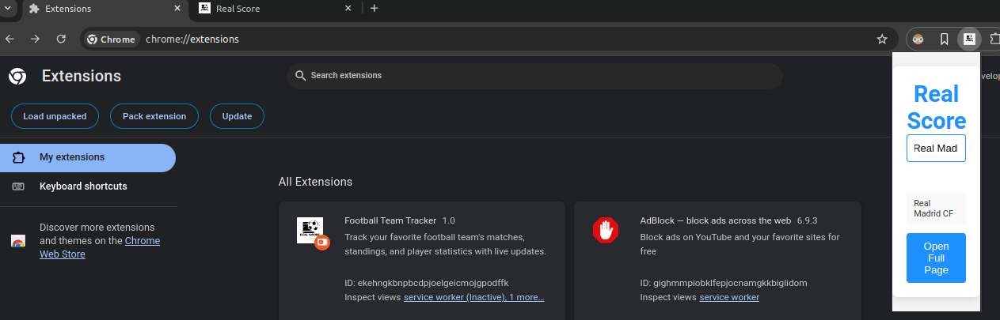
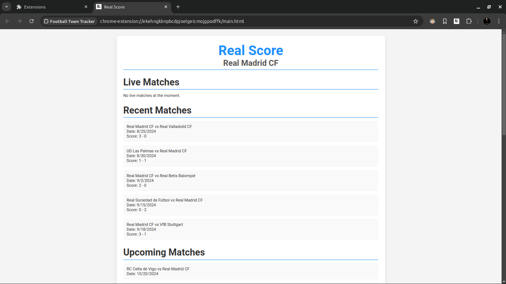
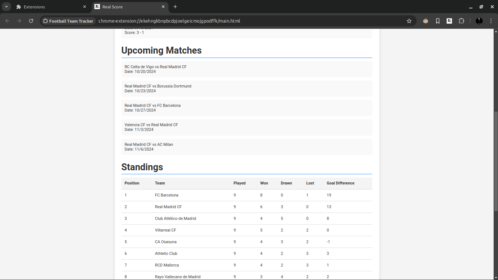
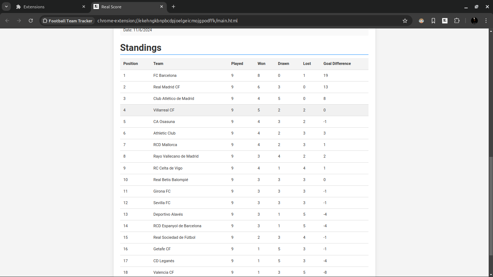

# ⚽ Real Score - Live Soccer Scorer Chrome Extension


### A minimalistic and real-time soccer scorer extension for you!

---

## 📖 Overview

**Real Score** is a simple and sleek Chrome extension designed to keep soccer enthusiasts updated with live scores, match statistics, and standings. Whether you're tracking your favorite team or monitoring live matches, Real Score provides all the essential data right within your browser.

---

## 🚀 Features

- **Team Search and Selection:** Easily search for and select your favorite teams.
- **Upcoming Matches:** View the schedule for your team's upcoming matches, complete with date, time, and opponent details.
- **Recent Matches:** Stay informed about your team's past performance with full-time results and match statistics.
- **League Standings:** Follow live standings for major leagues (e.g., Premier League, La Liga).
---

## 🖥 Full Page View

Unlike most extensions that limit information to a small popup, **Real Score** offers a **full-page view** experience. Get a complete, detailed view of matches, and more with just one click!

---

## 📦 Installation

1. **Clone or Download the Extension:**
    ```bash
    git clone https://github.com/your-repo/real-score.git
    ```

2. **Add the Extension to Chrome:**
   - Navigate to `chrome://extensions/`.
   - Enable **Developer Mode** (toggle in the top-right corner).
   - Click on **Load unpacked** and select the `Real Score` project folder.

3. **Enjoy the Real-time Soccer Experience!**

---

## 📚 How to Use

1. **Search for a Team:**
   - Open the extension by clicking on the icon in your toolbar.
   - Use the search bar to find your favorite team.
   - Click on the team name to select it and save it for future use.

2. **View Team Info:**
   - The full-page view will display upcoming and recent matches for your team.

---

## 📸 Screenshots

### Main Page





---

## 📄 License

This project is licensed under the MIT License - see the [LICENSE](LICENSE) file for details.

---
